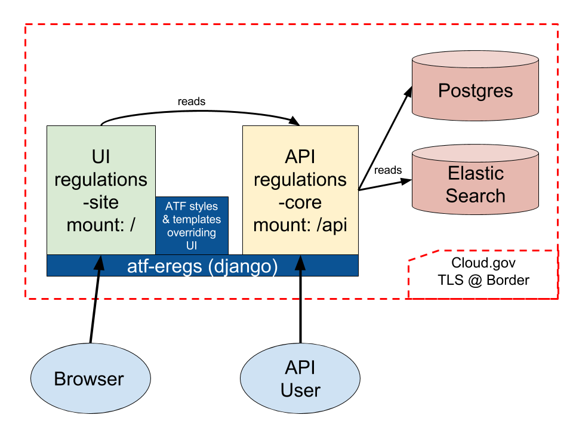
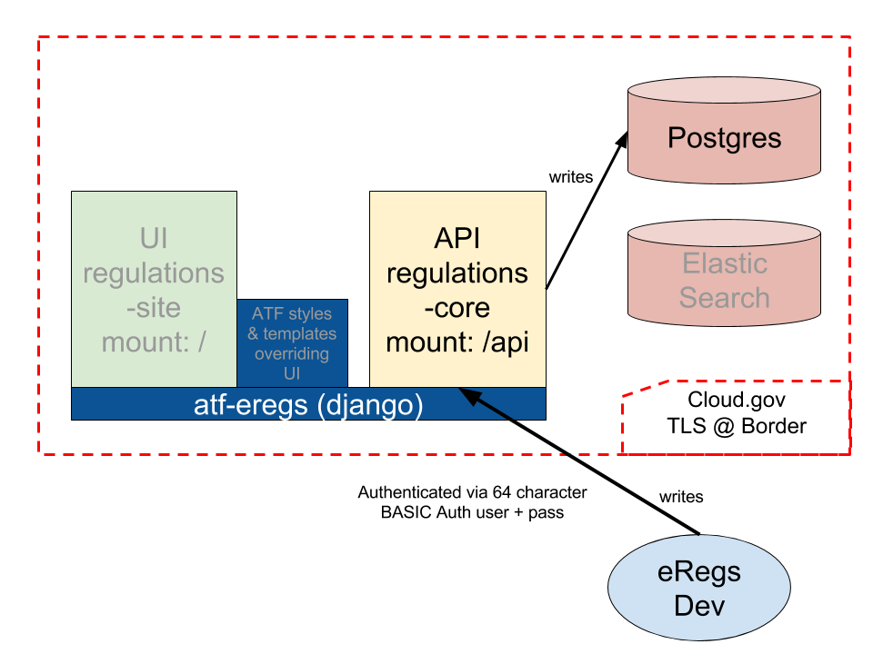

================
Production Setup
================

ATF eRegs is currently deployed on `cloud.gov <https://cloud.gov>`_, a PaaS
which abstracts away many of the annoying components of maintenance. As a
result, this documentation (and the production configuration files) are
largely geared towards hosting in this environment. See :ref:`Non-Cloud.gov`
for other environments.

Architecture
============

This repository is a cloud.gov app which stitches together two large Django
libraries with cloud.gov datastores and some ATF-specific styles and
templates. The first library, ``regulations-core``, defines an API for reading
and writing regulation and associated data. ``atf-eregs`` mounts this
application at the ``/api`` endpoint (details about the "write" API will be
discussed later). The second library, ``regulations-site``, defines the UI.
When rendering templates, ``regulations-site`` will first look in
``atf-eregs`` to see if the templates have been overridden. These views pull
their data from the API; this means that ``atf-eregs`` makes HTTP calls to
itself to retrieve data (when it's not already cached).

Updating Data
=============

When there is new data available (e.g. due to modifications in the parser, new
Federal Register notices, etc.), that data must be sent to the ``/api``
endpoint before it will be visible to users. However, we don't want to allow
the general public to modify the regulatory data, so we need to authenticate.
Currently, this is implemented via HTTP Basic Auth and a very long user name
and password (effectively creating an API key). See the ``HTTP_AUTH_USER`` and
``HTTP_AUTH_PASSWORD`` credentials in cloud.gov for more.

Currently, sending data looks something like this (from ``regulations-parser``)

.. code-block:: bash

  eregs pipeline 27 646 https://{HTTP_AUTH_USER}:{HTTP_AUTH_PASSWORD}@{LIVE_OR_DEMO_HOSTNAME}/api

This updates the data, but does not update the search index and will not clear
various caches. It's generally best to ``cf restage`` the application at this
point, which clears the caches and rebuilds the search index. Note that this
will also pull down the latest versions of the libraries (see the next
section); as a result it's generally best to do a full deploy after updating
data.

Deploying Code
==============
If the code within ``atf-eregs``, ``regulations-core``, or
``regulations-site`` has been updated, you will want to deploy the updated
code to cloud.gov. At the moment, we build all of the front-end code locally,
shipping the compiled CSS/JS when deploying. This means we'll need to update
our libraries, build the new front end, and push the result.

Confusingly, although the front-end compilation step occurs locally, all other
library linking (in particular to ``regulations-site`` and
``regulations-core``) takes place within cloud.gov. In other words, the setup
process for cloud.gov will pull in the latest from ``regulations-site`` and
``regulations-core``, regardless of what you have locally and regardless of
what you've built the front-end against. Be sure to always update your local
libraries (via ``pip``) before building and pushing.

You'll need a cloud-foundry shell and the zero-downtime deployment script. To
install:

.. code-block:: bash

  curl -L -o cf.tgz "https://cli.run.pivotal.io/stable?release=linux64-binary&version=6.15.0"
  tar xzvf cf.tgz -C .
  ./cf install-plugin autopilot -f -r CF-Community

To deploy, you can either set up these environmental variables to match your
cloud.gov info: ``API``, ``CF_USERNAME``, ``CF_PASSWORD``, ``ORG``, ``SPACE``
or you can use ``cf login`` yourself and comment out the second to last line
in ``deploy.sh`` in either case, deploy via:

.. code-block:: bash

  ./deploy.sh dev   # staging
  ./deploy.sh prod  # production

One word of caution here: if you receive an error about exceeding the
organization's memory limit, try modifying the number of instances in
``manifest_prod.yml`` to 1, retry deployment, then run ``cf scale atf-eregs -i 3``.

Services
========

This application uses the ``aws-rds`` service on cloud.gov. Services are bound
to applications in the manifest files. To create services:

.. code-block:: bash

  cf create-service aws-rds medium-psql atf-eregs-db

Our cloud.gov stack should have a user-provided service named
``atf-eregs-creds`` including the following credentials:

* ``HTTP_AUTH_USER`` - at least 32 characters long
* ``HTTP_AUTH_PASSWORD`` - at least 32 characters long
* ``NEW_RELIC_LICENSE_KEY``
* ``NEW_RELIC_APP_NAME``

To create this service:

.. code-block:: bash

  cf cups atf-eregs-creds -p '{"HTTP_AUTH_USER": "...", "HTTP_AUTH_PASSWORD": "...", "NEW_RELIC_LICENSE_KEY": "...", "NEW_RELIC_APP_NAME": "..."}'

To update, substitute ``cf uups`` for ``cf cups``.

.. _non-cloud.gov:

Non-Cloud.gov
=============

If you'd like to move this application off cloud.gov, you will need to
create an alternative settings file. Cloud.gov runs the following commands on
each deploy (also described in the "manifest" files). Note that these commands
are run within the context of a specific settings file, discussed shortly.

.. code-block:: bash

  python manage.py refresh
  python manage.py collectstatic --noinput
  gunicorn atf_eregs.wsgi:application

The first, ``refresh``, will migrate the database and populate the search
index (we'll see how to configure these in a moment). The command explicitly
checks a cloud.gov attribute to determine if it is the "first" server (as we
don't want to run these migrations on each), but it degrades nicely outside of
cloud.gov. If not within that environment, running ``refresh`` will always run
the migrations and rebuild the search index.

The second command, ``collectstatic``, gathers all of the static assets (CSS,
JS, images, etc.) into one location, for ease of hosting. See the Django
`docs <https://docs.djangoproject.com/en/1.9/ref/contrib/staticfiles/>`_
on that subject for more. Note that this does `not` build the frontend assets.
To do that, you'll need to run ``python manage.py compile_frontend`` first.

The final step starts the ``gunicorn`` server and points it to a WSGI file.
This file sets up a New Relic monitoring agent and wraps the webapp with a
static file hosting solution (``whitenoise``). Django does not host static
files,
`deferring <https://docs.djangoproject.com/en/1.9/howto/static-files/>`_ to a
variety of other solutions.

With a possible exception of the New Relic configuration (which pulls its
credentials from cloud.gov), this should all work outside of the cloud.gov
environment.

Prod Settings
-------------

The most complicated changes that would need to take place to move off
cloud.gov are found in the ``atf_eregs.settings.prod`` settings file (which is
interwoven as context throughout the deploy script). To make these changes,
you may either edit this file (in which case we would strongly recommend
committing these changes to a shared repository) or create a
``local_settings.py`` file within the same directory and only override the
attributes needed.

The ``DATABASES`` attribute uses the
`dj_database_url <https://github.com/kennethreitz/dj-database-url>`_ library
to pull database connection information from the implicitly defined
``DATABASE_URL`` environmental variable. If defining such a variable is not
feasible, the ``DATABASES`` attribute can be configured manually through
`traditional <https://docs.djangoproject.com/en/1.9/ref/databases/>`_
settings.

The current ``prod`` settings file overrides ``HTTP_AUTH_USER`` and
``HTTP_AUTH_PASSWORD`` with values derived from cloud.gov. By default,
however, those credentials are defined by similarly named environment
variables. They can also be manually configured in a settings file. These are
used to lock down `write` access to the API.

The ``ALLOWED_HOSTS`` setting `must` be configured when ``DEBUG`` is turned
off. It should contain a list of hostnames that the Django app should respond
to; the current ``prod`` settings file pulls these from the cloud.gov
environment. See Django's
`documentation <https://docs.djangoproject.com/en/1.9/ref/settings/#allowed-hosts>`_
on the topic for more details.

Gotchas
=======

Caching
-------
The production defaults `heavily` cache eRegs content. As the generated pages
change infrequently, most of the content is cached for days. While that works
fine for production, it may be rather confusing when initially setting
everything up. If you are expecting content to have changed, clear out the
eRegs caches:

.. code-block:: bash

  rm -rf /tmp/*eregs*
